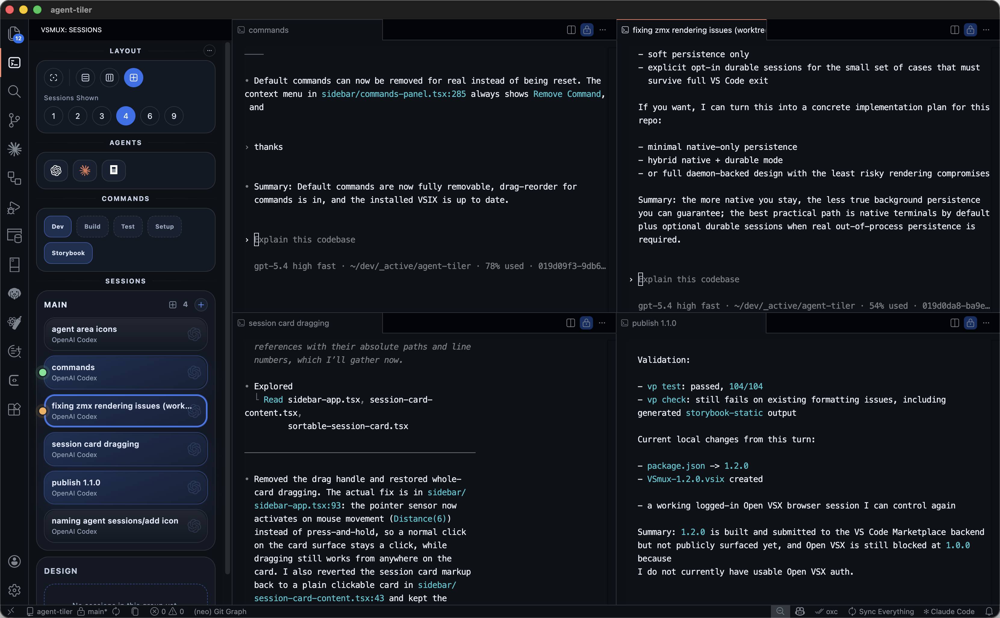

# VSmux: Manage all your CLI coding agents sessions without leaving your IDE.

For VS Code: https://marketplace.visualstudio.com/items?itemName=maddada.VSmux

For Cursor and Others: https://open-vsx.org/extension/maddada/VSmux

## New in 1.8.0

- Working on windows.

## New in 1.7.0

## New in 1.6.0

- Added browser support.
- Better UI across the workspace and session management flow.

> Current UI in v1.3 (still under development. Will be much nicer with time.)



---

Early version video showing the core experience of VSmux (will create a new video soon showing all of the new stuff): https://x.com/i/status/2034602427442503890

---

## The shpeel:

This extension is for you if:

- You like to code using multiple agent CLIs in parallel.
- You don't want to be locked into a tool like conductor or superset or w/e.
- You don't want to be missing out on the new features that are coming to the CLIs first.
- You also love to be close to the code for some projects and review changes in your favorite editor (VS Code/Cursor/Antigravity/etc.)
- Like to use VS Code to edit the md files and prompts (ctrl+g) before sending them to the agent cli.

Then this is the extension for you! You get a very nice interface to work with your agents without having to jump between the editor and the ADE tool.

> Inspired by Antigravity agent panel, Codex app, T3Code, CMux, and Superset + many more.

---

## Highly recommended VS Code Setup to work with worktrees and parallel agents

### 1. Enable Native Tabs

If you are on macOS, turn on VS Code's `window.nativeTabs` setting.

This makes it much easier to switch between projects, repos, and worktrees because each VS Code window can live in the same native tab strip. Instead of juggling separate windows, you can keep multiple VSmux workspaces open and move between them quickly with the normal macOS tab workflow.

### 2. Turn On Repositories Explorer for Worktrees

Enable `SCM > Repositories: Explorer`, and make sure `SCM > Repositories: Selection Mode` is set to `single`.

This exposes repository artifacts directly inside the Source Control UI, including branches, stashes, tags, and worktrees. It makes creating and managing Git worktrees much easier from the VS Code UI, without needing to drop into the terminal for every worktree action.

### 3. Set your $Editor in ~/.zshrc to your editor (code/cursor/etc.)

This lets you write your prompt inside your editor instead strugling with the annoying input box that these AI tools provide.
No more [50 lines pasted] nonsense. Paste all the lines you want and even select parts of them and use inline AI to edit those.

Gist on how to do this

---

## Companion App

VSmux works great with my other tool that shows all running agent sessions in a mini floating bar on macOS (with running/waiting/done indicators). Check it out here: https://github.com/maddada/agent-manager-x

---

## Contributions welcome 🙏🏻

## Getting Started

1. Open the Command Palette.
2. Run `VSmux: Open Workspace`.
3. Create your first session.
4. Use the sidebar and hotkeys to change the number of visible sessions and switch layouts.

## Settings

- `VSmux.backgroundSessionTimeoutMinutes`: controls how long detached background sessions stay alive after the last VSmux window disconnects
- `VSmux.sidebarTheme`: changes the sidebar theme preset
- `VSmux.showCloseButtonOnSessionCards`: shows or hides the close button on session cards
- `VSmux.sendRenameCommandOnSidebarRename`: stages `/rename <new name>` in the terminal when you rename from the sidebar

## Local T3 Embed Setup

The T3 embed frontend is intentionally local-only and gitignored. If you want T3 sessions to render inside VSmux while developing this extension, set up the local workspace below:

```text
forks/t3code-embed/
  upstream/   # local clone of pingdotgg/t3code
  overlay/    # your local patched T3 web files
  dist/       # generated embed build consumed by VSmux
```

### 1. Clone T3 locally

Clone T3 Code into:

```bash
git clone https://github.com/pingdotgg/t3code forks/t3code-embed/upstream
```

The integration was authored against commit `9e29c9d72895022322da52d8e961b38702bad9cc`.

### 2. Recreate the local patch overlay

Create the patched files under:

```text
forks/t3code-embed/overlay/apps/web/src/
```

The required file list and patch intent are documented in:

- [ai/t3-embed-patches.md](/Users/madda/dev/_active/agent-tiler/ai/t3-embed-patches.md)
- [ai/2026-03-22 t3 embedded sessions implementation.md](/Users/madda/dev/_active/agent-tiler/ai/2026-03-22%20t3%20embedded%20sessions%20implementation.md)

### 3. Build the local embed bundle

Make sure `bun` is installed, then run:

```bash
node ./scripts/build-t3-embed.mjs
```

That script copies the overlay into `forks/t3code-embed/upstream`, builds T3's web app, and writes the generated bundle to `forks/t3code-embed/dist`.

### 4. Build the extension

Run:

```bash
vp install
vp check
vp test
```

If `forks/t3code-embed/dist` is missing, the extension still builds, but T3 sessions will show the missing-assets placeholder until you generate the local embed bundle.

---

## Features

### Session Management

- **Create, rename, restart, and close** terminal sessions from the sidebar
- **Session groups** — organize sessions into up to 4 named groups, rename groups, and drag sessions between them
- **Drag-and-drop reordering** — reorder sessions within and across groups, reorder command buttons
- **Session aliases** — each session gets an auto-generated word alias (Atlas, Beacon, Comet, etc.)
- **Previous session history** — closed sessions are archived (up to 200) and can be browsed or restored from a modal

### Layout & Views

- **Three view modes** — Horizontal, Vertical, and Grid layouts (Cmd+Alt+H/V/G)
- **Configurable visible count** — show 1, 2, 3, 4, 6, or 9 sessions at once
- **Fullscreen / focus mode** — toggle a single session to fill the entire view (Cmd+Alt+F)
- **Session slot hotkeys** — jump to any session slot with Cmd+Alt+1–9
- **Group focus hotkeys** — switch between groups with Ctrl+Alt+Shift+1–4
- **Directional focus navigation** — move focus up/right/down/left across sessions

### Agent Launchers

- **Built-in agent buttons** — one-click launch for T3 Code, Codex, Claude Code, OpenCode, and Gemini
- **Custom agents** — add your own agent launchers with custom commands and names
- **Agent icon detection** — session cards show the agent logo watermark based on what's running
- **Edit and delete agents** — right-click context menu on agent buttons

### Command Shortcuts

- **Sidebar command buttons** — quick-launch buttons for Dev, Build, Test, Setup (or your own)
- **Custom commands** — create commands with a name, shell command, and optional close-on-exit behavior
- **Drag-and-drop reordering** — reorder command buttons in the sidebar
- **Edit and delete commands** — right-click context menu on command buttons

### Activity Tracking

- **Three activity states** — idle, working, and attention indicators on session cards
- **Claude Code title detection** — automatically detects Claude Code idle/working state from terminal title
- **Shell integration** — detects agent start/stop lifecycle events via control sequences
- **Codex log pattern matching** — parses Codex CLI log output for task_started/task_complete events
- **Completion bell** — plays a sound when an agent finishes (toggle per project from the sidebar)
- **10 completion sounds** — Arcade, African, Afrobeat, EDM, Come Back To The Code, Glass, Ping, Shamisen, Superset Doo-Wap, Superset Quick

### T3 Code Integration

- **Embedded T3 sessions** — T3 Code runs directly inside the VSmux sidebar as a webview
- **T3 activity monitoring** — WebSocket connection to local T3 runtime tracks thread activity in real time
- **T3 session lifecycle** — automatic supervision, sync, and management of T3 sessions

### Theming

- **11 sidebar theme presets** — Auto, Plain, Dark Green/Blue/Red/Pink/Orange, Light Blue/Green/Pink/Orange
- **Auto theme** — follows the active VS Code theme (dark or light)

### Keyboard Shortcuts

| Action                 | macOS              | Windows/Linux      |
| ---------------------- | ------------------ | ------------------ |
| Focus session slot 1–9 | Cmd+Alt+1–9        | Ctrl+Alt+1–9       |
| Focus group 1–4        | Ctrl+Alt+Shift+1–4 | Ctrl+Alt+Shift+1–4 |
| Horizontal view        | Cmd+Alt+H          | Ctrl+Alt+H         |
| Vertical view          | Cmd+Alt+V          | Ctrl+Alt+V         |
| Grid view              | Cmd+Alt+G          | Ctrl+Alt+G         |
| Fullscreen toggle      | Cmd+Alt+F          | Ctrl+Alt+F         |
| Rename active session  | Cmd+Alt+R          | Ctrl+Alt+R         |
| Show 6 terminals       | Cmd+Alt+Shift+6    | Ctrl+Alt+Shift+6   |
| Show 9 terminals       | Cmd+Alt+Shift+9    | Ctrl+Alt+Shift+9   |

### Other

- **Sidebar rename → terminal rename** — renaming from the sidebar optionally stages `/rename <name>` in the terminal
- **Cmd+click or middle-click to close** — close sessions without needing a visible close button
- **Configurable close button visibility** — show/hide close buttons on session cards
- **Configurable hotkey label visibility** — show hotkey labels on cards always or only on hover
- **Background session timeout** — configurable timeout for detached background sessions (or keep alive forever)
- **Debug panel** — inspect terminal workspace state and layout operations in real time
- **Companion app** — works with [agent-manager-x](https://github.com/maddada/agent-manager-x) for a floating macOS status bar
