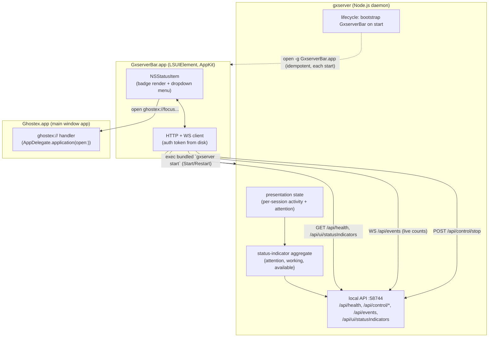
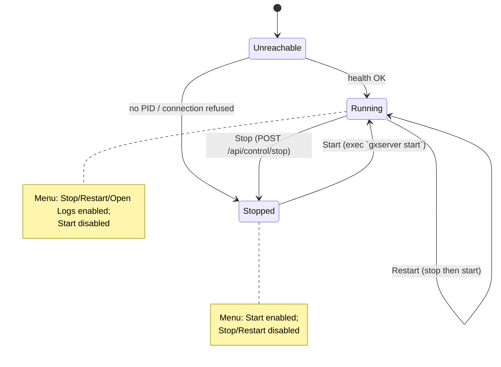

# feat: gxserver Menu Bar Agent

## Summary

Today the macOS menu bar status item lives inside the main `Ghostex.app` (`SessionStatusIndicatorController`). It renders session-status badges (attention / working / available counts) fed by the React sidebar, and clicking it focuses a session in the sidebar. It only exists while the main window app is running.

This plan **moves the menu bar presence out of the main app and into a gxserver-owned, standalone LSUIElement agent** (`GxserverBar.app`). The new agent:

- Shows the daemon's run state and provides **server control** — Start / Stop / Restart, Open Logs, Quit.
- Continues to show the **session-status indicator** (attention / working / available), but now derived from gxserver's own presentation state instead of the React sidebar.
- Talks to the daemon over the existing local HTTP + WebSocket API on `127.0.0.1:58744`.
- **Outlives the daemon** so it can start the server when it's stopped; gxserver bootstraps it on first run.

After the move, `SessionStatusIndicatorController` is removed from `Ghostex.app` entirely. Floating / in-window indicators must keep working — but they are **not** untouched: they currently share a protocol message and click-handler path with the menu-bar item (see R-A), so U6 has to split that shared surface carefully rather than treat the floating indicators as out of scope.

---

## Problem Frame

The menu bar status item is currently coupled to the main window app and to the React sidebar as its data source. That has two problems the user wants solved:

1. **Wrong owner.** The daemon (gxserver) is the long-lived process that survives the app being closed (`AppDelegate.swift:769` — "Closing or quitting the macOS app must not stop gxserver"). A control surface for the server should live with the server, not the window app that comes and goes.
2. **No server control.** The current icon is a passive status indicator. The user wants the menu bar to actually **control the server** (start/stop/restart/logs), which the main-app indicator never did.

The hard constraint: **gxserver is a pure Node.js daemon and cannot render an `NSStatusItem`** — AppKit menu bar items require a GUI process. So "move to gxserver" means gxserver *owns and launches* a thin native menu bar agent and supplies its data, not that Node draws the menu bar itself.

---

## Requirements

- **R1.** A standalone macOS menu bar agent (`GxserverBar.app`, LSUIElement) presents an `NSStatusItem` and a dropdown menu.
- **R2.** The menu exposes server control: **Start**, **Stop**, **Restart**, **Open Logs**, **Quit agent** — with items enabled/disabled based on current daemon state.
- **R3.** The status item reflects live daemon run state (running / stopped / unreachable) and the session-status indicator counts. Display rule (preserve current behavior, `SessionStatusIndicatorController.swift:124`): show `available` **only** when both `attention` and `working` are zero (all-idle); otherwise show only the non-zero attention/working badges.
- **R4.** Indicator counts are derived from **gxserver presentation state** (the single source of truth), not from the React sidebar.
- **R5.** The agent reads the daemon health/control/event APIs over `127.0.0.1:58744` using the existing bearer token at `~/.ghostex/gxserver/auth/token`.
- **R6.** The agent **persists across daemon stop/restart** so it can Start the daemon when down. gxserver bootstraps the agent on startup if it isn't already running (daemon-driven; no login item — see KTD4).
- **R7.** The menu's first item, **"Open Ghostex"**, focuses / launches the main `Ghostex.app` via the existing `ghostex://` URL scheme. Interaction is **menu-first** (KTD7): there is no bare-icon or badge sub-region click. Per-session focus, if included, is a menu item below "Open Ghostex".
- **R8.** `SessionStatusIndicatorController` and its menu bar wiring are removed from `Ghostex.app`. Floating / in-window indicators (if separate) are preserved.
- **R9.** The agent is built and bundled with gxserver, gated to macOS; Linux/standalone server packaging is unaffected.

---

## High-Level Technical Design

### Process & data flow (target state)



### Server-control state machine (menu enablement)



Once bootstrapped, the agent persists across daemon stop/restart, so when `Stopped`/`Unreachable` it remains the surviving control surface — which is why Start cannot depend on the daemon being alive. The agent is **not** a login item; after a cold reboot it returns the next time gxserver starts (matching today's behavior, where there is no menu bar until the app/daemon runs).

---

## Output Structure

New native target (paths illustrative; the implementer may adjust layout):

```text
native/macos/gxserverBar/
├── project.yml                      # or a new target added to the existing native/macos/ghostexHost/project.yml
└── Sources/gxserverBar/
    ├── main.swift                   # NSApplication bootstrap, LSUIElement
    ├── GxserverBarAppDelegate.swift # status item lifecycle, menu, polling/WS wiring
    ├── GxserverBarClient.swift      # slim HTTP/WS + auth-token client (ported from GxserverClient.swift)
    ├── StatusIndicatorRenderer.swift# badge image rendering (moved from SessionStatusIndicatorView)
    └── ServerControl.swift          # start/stop/restart + open-logs + ghostex:// focus
```

The per-unit `**Files:**` sections remain authoritative.

---

## Key Technical Decisions

- **KTD1 — Standalone LSUIElement agent, not a main-app helper.** `GxserverBar.app` is a separate bundle so it can survive `Ghostex.app` being closed and be owned by gxserver. (Confirmed with user.) Trade-off: a second signed/notarized bundle to package and a second process; accepted because the daemon-survival requirement (R6) and "owned by the server" intent demand independence.

- **KTD2 — Indicator counts are aggregated server-side in gxserver.** Rather than porting the sidebar's bucket-mapping into Swift, gxserver derives `{attentionCount, workingCount, availableCount}` from its existing presentation activity (`GxserverPresentationSessionActivity = "attention" | "idle" | "working"`, `gxserver/protocol/index.ts:975`) and exposes it via a GET endpoint + a field on the event-stream broadcast. This makes gxserver the single source of truth (R4) and avoids divergence between the sidebar and the agent. Trade-off: a small new aggregation + endpoint vs. duplicating mapping logic in Swift; chosen for single-source-of-truth.

- **KTD3 — Agent persists; Start/Restart shell out to a fixed bundle-relative `gxserver` launcher; Restart waits for stop.** The agent is never killed by daemon stop. To Start the daemon when down, the agent execs the packaged `gxserver` launcher script (which resolves the bundled Node — created by `package-gxserver.mjs`), i.e. `gxserver start`. The launcher path is resolved from a **fixed location relative to the agent's own bundle inside `Ghostex.app`** and validated (must exist inside the bundle) before exec — it is **not** read from daemon-written runtime metadata. Stop uses `POST /api/control/stop`. **Restart = Stop, then poll until the daemon is actually unreachable, then Start** — because `/api/control/stop` responds *before* shutdown completes (`gxserver/src/server.ts:902`); an immediate `gxserver start` would see the old daemon still running and exit, after which the old daemon then shuts down. Reuse the existing wait-for-stopped poll (`GxserverClient.swift:464`).

- **KTD4 — gxserver bootstraps the agent on startup; daemon-driven only, no login item.** On `runGxserverForeground`/background start, gxserver launches `GxserverBar.app` via `open -g` **only when it can resolve the staged bundle** (see U3); absent bundle is a no-op. The agent is **not** registered as a login item: `SMAppService.loginItem` cannot register an arbitrary gxserver-staged standalone `.app` (it requires the bundle inside a parent app's `Contents/Library/LoginItems/`, and login items are user-disableable / lost on Sparkle update). Persistence is therefore **daemon-driven**: the agent survives daemon stop/restart once running, and after a cold reboot returns the next time gxserver starts — matching today's "no menu bar until the app/daemon runs" behavior. Trade-off accepted: no menu bar after reboot until gxserver next launches; this avoids the login-item layout/signing fragility entirely.

- **KTD5 — Cross-process focus via `ghostex://`, from menu items.** Selecting "Open Ghostex" (or a session menu item) opens a `ghostex://` URL handled by `AppDelegate.application(_:open:)` (`AppDelegate.swift:718`), launching/focusing the main app. App-focus is in scope now; a per-session focus route (new `handleOSIntegrationURL` case — today only `terminal`/`open`/`edit` exist) is deferred to follow-up unless its contract is defined during U5.

- **KTD6 — Share rendering by moving, not duplicating.** The badge-image rendering currently in `SessionStatusIndicatorView` (`SessionStatusIndicatorController.swift:380-453`) moves into the agent. Since the main-app indicator is being removed (R8), there is no shared consumer to factor a module for — the code relocates wholesale.

- **KTD7 — Menu-first interaction; no badge/sub-region click.** A status item cannot natively expose both a bare click action and an attached `NSMenu` — attaching a menu makes macOS intercept every click to open it, and the current sub-region badge click only works *because* there is no menu (`SessionStatusIndicatorController.swift:550`). Resolution: **attach the menu.** Its first item is **"Open Ghostex"** (app focus); session/status-bucket focus actions are **menu items below it**, not clickable badge regions. R7/U5 are written menu-first accordingly.

---

## Implementation Units

### U1. gxserver: status-indicator aggregation + control surface

**Goal:** Make gxserver the source of truth for the menu bar's data and confirm the control endpoints the agent needs.

**Requirements:** R3, R4, R5.

**Dependencies:** none.

**Files:**
- `gxserver/src/session-presentation.ts` (or new `gxserver/src/status-indicators.ts`) — derive `{attentionCount, workingCount, availableCount}` from presentation activity + attention state.
- `gxserver/src/api.ts` — add `GET /api/ui/statusIndicators` (authenticated, local).
- `gxserver/src/events.ts` — include the aggregate (or a `statusIndicators` delta) in event-stream broadcasts so counts update live.
- `gxserver/protocol/index.ts` — add the `GxserverStatusIndicators` type (counts + the `hideMenuBarSessionStatusIndicators` preference) and endpoint constant.
- `gxserver/test/status-indicators.test.ts` (new), extend `gxserver/test/session-presentation.test.ts`, `gxserver/test/api.test.ts`, `gxserver/test/events.test.ts`.

**Approach:** Map presentation activity → buckets: `working` → working; sessions with active attention state → attention; `idle` → available. Mirror the bucket semantics the sidebar uses today so counts are unchanged from the user's perspective. The aggregate carries raw counts plus the `hideMenuBarSessionStatusIndicators` preference (the agent's only needed pref — badge `size` is *not* needed: the menu-bar indicator is hard-coded small today, `SessionStatusIndicatorController.swift:159`, and `size` applies only to the floating panel). The `available`-suppression display rule (show available only in the all-idle case) is applied by the agent at render time (U2), not by zeroing the count here. Broadcast the aggregate on the existing `/api/events` stream alongside presentation snapshots.

**Patterns to follow:** existing endpoint descriptors and auth gating in `gxserver/src/api.ts:16-90`; event broadcast shape in `gxserver/src/events.ts`.

**Test scenarios:**
- Happy path: presentation with 2 working, 1 attention, 3 idle sessions → `{attention:1, working:2, available:3}`.
- Edge: zero sessions → all-zero counts; a session simultaneously attention+working resolves to a single deterministic bucket (define precedence: attention wins).
- Edge: attention acknowledged / suppressed (`acknowledgeAttention`, `attentionSuppressedUntil`) is not counted as attention.
- Error: malformed presentation row does not crash aggregation (skipped, logged).
- Integration: a session transitioning idle→working emits an updated aggregate on the `/api/events` stream.
- `GET /api/ui/statusIndicators` requires bearer token; 401 without it.

**Verification:** New endpoint returns correct counts for seeded state; event stream emits an updated aggregate when session activity changes.

---

### U2. New `GxserverBar` Swift menu bar agent

**Goal:** A standalone LSUIElement app with an `NSStatusItem`, dropdown menu, live status, and a client for the daemon API.

**Requirements:** R1, R2, R3, R5, R7.

**Dependencies:** U1 (consumes the aggregate + endpoint).

**Files:**
- `native/macos/gxserverBar/Sources/gxserverBar/main.swift` — NSApplication + LSUIElement bootstrap.
- `native/macos/gxserverBar/Sources/gxserverBar/GxserverBarAppDelegate.swift` — status item creation, menu, health polling + WS subscription wiring.
- `native/macos/gxserverBar/Sources/gxserverBar/GxserverBarClient.swift` — HTTP health/status/control + WS event subscription + auth-token read.
- `native/macos/gxserverBar/Sources/gxserverBar/StatusIndicatorRenderer.swift` — badge image rendering moved from `SessionStatusIndicatorView`.
- `native/macos/gxserverBar/Sources/gxserverBar/ServerControl.swift` — Stop (HTTP), Open Logs, "Open Ghostex" via ghostex:// (Start/Restart land in U3).
- `native/macos/gxserverBar/Info.plist` — `LSUIElement = true`, bundle id `com.madda.ghostex.bar`.
- Tests: `native/macos/gxserverBar/Tests/...` for bucket→render mapping and client request construction (auth header, protocol-version header, base URL).

**Approach:** Port the slim, read-only/control parts of `GxserverClient.swift` (base URL `http://127.0.0.1:58744`, protocol version `1`, token read from `~/.ghostex/gxserver/auth/token`, health GET, `POST /api/control/stop`). Subscribe to `/api/events` for live counts; fall back to short-interval polling of `GET /api/ui/statusIndicators` if the socket drops. Render the status item via the moved renderer, applying the `available`-suppression rule (R3) and honoring `hideMenuBarSessionStatusIndicators`. Interaction is **menu-first** (KTD7): an `NSMenu` is attached, so there is no bare-icon/badge click; the menu's first item is "Open Ghostex". Menu items reflect the state machine (enable/disable by daemon state).

**Patterns to follow:** `GxserverClient.swift:97-200` (client constants, token read, health polling), `SessionStatusIndicatorController.swift:40-75` (status item creation) and `:380-453` (badge rendering).

**Test scenarios:**
- Happy path: counts `{attention:1, working:2, available:3}` render **two** badges (attention + working); `available` is suppressed because attention/working are non-zero (R3, `:124`).
- Display rule: all-idle `{0,0,3}` renders the single `available` badge; `{0,0,0}` renders no count badges.
- Preference: `hideMenuBarSessionStatusIndicators = true` hides the count badges entirely.
- Menu: first item is "Open Ghostex"; Stop/Restart/Open Logs enabled when health OK.
- State: health unreachable → "Stopped" presentation, Start enabled, Stop/Restart disabled.
- Client: requests carry `Authorization: Bearer <token>` and `x-gxserver-protocol-version: 1`; missing token surfaces a clear error state rather than crashing.
- Edge: WS disconnect falls back to polling and recovers when the socket returns.
- Integration: selecting "Open Ghostex" issues the expected `ghostex://` open.

**Verification:** Launching the agent against a running daemon shows correct live counts and a working Stop/Open Logs; against a stopped daemon shows Stopped + Start.

---

### U3. gxserver lifecycle: bootstrap and own the agent; agent Start/Restart

**Goal:** gxserver launches the agent on startup (idempotently); the agent can Start/Restart the daemon and persists across stops.

**Requirements:** R2, R6.

**Dependencies:** U2.

**Files:**
- `gxserver/src/lifecycle.ts` — on start (macOS only), `open -g` the bundled `GxserverBar.app` if not already running.
- `gxserver/src/lifecycle.ts` / `gxserver/src/constants.ts` — agent bundle-relative path constant used by gxserver to resolve and `open -g` the staged agent. (No launcher/agent paths are written to runtime metadata — see KTD3 / R-I.)
- `native/macos/gxserverBar/Sources/gxserverBar/ServerControl.swift` — Start execs the `gxserver` launcher resolved from a **fixed path relative to the agent's own bundle inside `Ghostex.app`**, validated (must exist inside the bundle) before exec. **Restart** = `POST /api/control/stop`, then poll until the daemon is actually unreachable, then exec `gxserver start` (see KTD3; stop is async — `server.ts:902`). No login-item registration.
- Tests: `gxserver/test/lifecycle.test.ts` (agent-bootstrap is macOS-gated and idempotent — does not relaunch when already running).

**Approach:** gxserver gates the bootstrap on **actually resolving the staged agent bundle relative to its own `cli.js` location** (e.g. `Contents/Resources/.../GxserverBar.app`), not merely on `process.platform === "darwin"`. Standalone/headless macOS installs (Homebrew, server tarball) have no app bundle and therefore no agent — "agent bundle absent" is a normal no-op, matching how packaging is already gated. When the bundle resolves and the agent isn't already running, gxserver launches it detached via `open -g` (background, no focus steal). The daemon never terminates the agent on stop. The agent is **not** a login item (KTD4) — persistence is daemon-driven, so after a cold reboot the agent returns the next time gxserver starts. Start execs the packaged `gxserver` launcher (resolves bundled Node — see `package-gxserver.mjs:196-209`) from a fixed bundle-relative, pre-validated path; **Restart waits for the daemon to be unreachable between stop and start** (`server.ts:902` returns before shutdown completes; reuse the wait-for-stopped poll at `GxserverClient.swift:464`).

**Execution note:** Start with a failing `lifecycle.test.ts` asserting the macOS-gated, idempotent bootstrap before wiring the `open` call.

**Patterns to follow:** detached spawn precedent in `gxserver/src/lifecycle.ts:73-78`; the main app's detached `nohup` daemon launch in `GxserverClient.swift:492-515` (the inverse direction, same "don't retain handle" posture).

**Test scenarios:**
- Happy path: start on macOS with agent absent → bootstrap invoked once.
- Idempotency: start with agent already running → no second launch.
- Platform gate: start on Linux → bootstrap never invoked; no error.
- Restart: Stop is issued, the agent waits until health is unreachable, *then* Start runs — result is a single fresh healthy daemon (no race where Start exits because the old daemon is still up, then the old daemon dies).
- Edge: Start when the bundle-relative launcher path fails validation surfaces a clear agent error, no exec.

**Verification:** Cold `gxserver start` on macOS brings up the menu bar agent; quitting the daemon from the menu leaves the agent alive showing Stopped with a working Start; Restart reliably yields exactly one running daemon.

---

### U4. Packaging: build and bundle `GxserverBar.app` (macOS-gated)

**Goal:** Build the Swift agent and stage it where lifecycle (U3) can find and launch it, without affecting Linux/standalone packaging.

**Requirements:** R9.

**Dependencies:** U2.

**Files:**
- `native/macos/ghostexHost/project.yml` (or new `native/macos/gxserverBar/project.yml`) — add the `gxserverBar` application target (LSUIElement, deployment target 13.0, automatic signing to match `ghostex`).
- `native/macos/ghostexHost/build-ghostex-host.sh` — build the agent (XcodeGen + `xcodebuild`) and stage `GxserverBar.app` into the **app bundle** alongside the existing `Web/gxserver` copy. **Not** `package-gxserver.mjs`: `check-package.mjs` explicitly fails the server-only package if it contains any `.app`/`AppKit`/`xcodebuild` content, so the agent build must live in the app-bundle staging path, keeping `package-gxserver.mjs` headless.
- `gxserver/scripts/check-package.mjs` — its existing forbidden-content assertions stay; add the agent-presence assertion against the **app-bundle staging path**, not the server tarball.
- Tests: extend `gxserver/test/packaging.test.ts` for the macOS-gated staging path.

**Approach:** Mirror the existing app-bundle staging in `package-gxserver.mjs` (which already stages gxserver into `Contents/Resources/Web/gxserver`). Add a sibling step that, on darwin, builds and copies `GxserverBar.app`. Non-darwin packaging (Linux tarball, Homebrew) is untouched.

**Patterns to follow:** staging + Node-launcher creation in `gxserver/scripts/package-gxserver.mjs:196-209`; signing config in `native/macos/ghostexHost/project.yml`.

**Test scenarios:**
- macOS package includes `GxserverBar.app` at the expected relative path; `check-package.mjs` passes.
- Linux/standalone package excludes the agent and still passes its checks.
- `Test expectation: integration` — packaging is verified by the package/check scripts; no unit behavior beyond path presence.

**Verification:** `npm run package:app` produces a bundle whose gxserver can locate and launch the agent; `npm run package:check` passes on macOS.

---

### U5. Cross-process app focus from the agent

**Goal:** The "Open Ghostex" menu item launches / focuses the main `Ghostex.app`.

**Requirements:** R7.

**Dependencies:** U2.

**Files:**
- `native/macos/gxserverBar/Sources/gxserverBar/ServerControl.swift` — open a `ghostex://` URL for app focus.
- `native/macos/ghostexHost/Sources/ghostexHost/AppDelegate.swift` — confirm/extend the `ghostex://` route in `application(_:open:)` (`:718`) to bring the app to front.

**Approach:** Selecting "Open Ghostex" opens a `ghostex://` URL (reuse the scheme registered at `project.yml:99`) that activates the main app. **Per-session focus is deferred to follow-up:** the old behavior was an in-process `sessionStatusIndicatorClicked` → sidebar event (`SessionStatusIndicatorController.swift:583`), which is unavailable cross-process, and `handleOSIntegrationURL` today supports only `terminal`/`open`/`edit` (no focus-session case). Adding a focus-session route + handler case is its own work item; this unit ships app-focus only. If a focus-session route is defined here instead, validate the session id in the handler (the scheme is system-wide — any app can send a `ghostex://` URL).

**Test scenarios:**
- Happy path: "Open Ghostex" with the app closed launches and focuses `Ghostex.app`.
- Happy path: "Open Ghostex" with the app already running brings it to front.
- Integration: the `ghostex://` handler receives the expected app-focus URL.
- Security (if focus-session is added): a malformed/unknown session id no-ops rather than dispatching to an arbitrary handler branch.

**Verification:** "Open Ghostex" reliably brings the main app forward.

---

### U6. Remove `SessionStatusIndicatorController` from `Ghostex.app`

**Goal:** Delete the main-app menu bar status item and its wiring, leaving the gxserver agent as the sole menu bar presence. Preserve floating / in-window indicators.

**Requirements:** R8.

**Dependencies:** U1, U2, U3, U4 (only remove the old surface once the new one is proven to launch and work *and* the server-side aggregation in U1 is confirmed complete).

**Files:**
- `native/macos/ghostexHost/Sources/ghostexHost/SessionStatusIndicatorController.swift` — delete (or reduce to floating-only if floating indicators live here).
- `native/macos/ghostexHost/Sources/ghostexHost/AppDelegate.swift` — remove the `sessionStatusIndicatorController` property (`:608`) and its update/visibility wiring.
- `native/macos/ghostexHost/Sources/ghostexHost/HostProtocol.swift` — remove the menu-bar-specific fields/handling from `SetSessionStatusIndicators` (`:845-852`); keep `hideFloatingIndicators` if floating indicators remain.
- `native/macos/ghostexHost/Sources/ghostexHost/TerminalWorkspaceView.swift` — remove menu-bar indicator references.
- Sidebar TypeScript that emits the menu bar counts (the `SetSessionStatusIndicators` producer) — stop sending menu-bar counts; retain any floating-indicator path.

**Approach:** Surgical removal scoped to the **menu bar** status item only. Before deleting, confirm whether `hideFloatingIndicators` / floating indicators are a distinct surface that must survive; if so, preserve that code path and remove only the `NSStatusBar`/menu-bar portions. The sidebar no longer needs to push menu bar counts because gxserver now owns the aggregate (U1).

**Execution note:** Add characterization confirmation (build + manual smoke) that floating indicators still render before deleting menu-bar code.

**Test scenarios:**
- Happy path: app builds and launches with no menu bar status item from `Ghostex.app`.
- Regression: floating / in-window indicators (if any) still render and respond.
- Edge: sidebar no longer emitting menu-bar counts does not break the floating-indicator path or log errors.
- `Test expectation: none for pure deletions` — covered by build + the regression smoke above.

**Verification:** Only one menu bar item exists (the gxserver agent); floating indicators unchanged; no dead references to the removed controller.

---

## Scope Boundaries

**In scope:** the menu bar status item move (control + status), gxserver-side count aggregation, the new agent, its packaging/launch/persistence, cross-process focus, and removal of the old controller.

### Deferred to Follow-Up Work
- A dedicated `/api/control/restart` endpoint (Restart is composed from stop + exec start for now).
- Richer menu content (per-session list, project switching) beyond the three status badges + control actions.
- Notarization/signing automation specifics for the second bundle (handled by existing release tooling; only the target + staging are added here).

### Out of scope / non-goals
- Floating / in-window session indicators — their behavior is preserved (no feature changes), though U6 must restructure the protocol message they share with the menu-bar item (R-A).
- Linux/standalone server behavior — packaging is gated so it is unaffected.
- Changing the daemon's port, auth model, or protocol version.
- Remote / connection-profile gxserver instances — the agent represents and controls **only** the local daemon on `127.0.0.1:58744`; remote instances are not surfaced or controlled by the menu bar.

---

## Risks & Dependencies

- **R-A — Floating vs menu-bar indicator entanglement (confirmed).** `SetSessionStatusIndicators` (`HostProtocol.swift:845-851`) bundles floating fields (`hideFloatingIndicators`, `size`) and menu-bar fields (`hideMenuBarIndicators`, counts) in one message, and `AppDelegate.swift:2161` is a **shared** click handler for both floating and menu-bar clicks. Deleting `SessionStatusIndicatorController` in U6 will silently break floating indicators unless the protocol message is split and the floating click path is preserved. *Mitigation:* U6 splits the message (floating-only native command) and keeps the floating click path before removing any menu-bar code; verify floating indicators still render/respond first.
- **R-F — Agent needs the hide-menu-bar preference (not size).** The menu-bar indicator is hard-coded small today (`SessionStatusIndicatorController.swift:159`); `size` applies only to the floating panel, so the agent needs no size source. It does need `hideMenuBarSessionStatusIndicators`. *Mitigation:* U1 carries that one preference on the aggregate.
- **R-G — Packaging guardrail.** Staging the `.app` in `package-gxserver.mjs` would break `check-package.mjs`'s server-only assertions. *Mitigation:* stage in `build-ghostex-host.sh` (U4).
- **R-H — Dev/prod flavor collision (accepted: single-instance-on-prod).** The agent ships with one fixed bundle id (`com.madda.ghostex.bar`) and targets the standard local endpoint/token (`127.0.0.1:58744`, `~/.ghostex/gxserver/auth/token`). Developers running `ghostex-dev` alongside the installed app do **not** get a separate menu bar agent; the single agent controls whichever daemon owns port `58744`. *Decision (maintainer):* this is acceptable — no flavor-aware bundle id / home / port is needed. (Note: dev and prod daemons already can't run simultaneously since port `58744` is a fixed constant.)
- **R-I — Command-injection / path-integrity on Start.** The agent execs a `gxserver` launcher path; if that path comes from a world-writable runtime-metadata file, a tampered path is executed with the user's privileges by a persistent process. *Mitigation:* resolve the launcher from a fixed bundle-relative location (not daemon-written metadata), write `~/.ghostex/gxserver/auth/token` and any metadata 0600, and validate the path is inside the bundle before exec.
- **R-B — Agent persistence vs daemon-launched lifecycle.** If the agent were killed on daemon stop, Start would be impossible. *Mitigation:* KTD3/KTD4 — gxserver bootstraps the agent; the daemon never kills it, so it survives stop. Not a login item; after cold reboot it returns when gxserver next starts.
- **R-C — Second signed bundle.** Adds notarization/signing surface and could break release if not staged correctly. *Mitigation:* match `ghostex` target signing config; `check-package.mjs` asserts presence.
- **R-D — Start path correctness.** The agent must locate the bundled `gxserver` launcher; a wrong path silently breaks Start. *Mitigation:* fixed bundle-relative path validated before exec (KTD3); clear error state on failure. (Path is *not* read from runtime metadata.)
- **R-J — Restart race.** `POST /api/control/stop` returns before shutdown completes (`server.ts:902`); an immediate Start sees the old daemon and exits. *Mitigation:* Restart waits for unreachable between stop and start (KTD3, `GxserverClient.swift:464`).
- **R-E — Bucket-mapping fidelity.** Server-side aggregation must reproduce the sidebar's current attention/working/available semantics or counts will visibly change. *Mitigation:* U1 tests pin precedence (attention wins) and acknowledged/suppressed handling.

---

## Resolved Decisions (maintainer review, 2026-06-13)

These plan-review forks were resolved in maintainer review and folded into the units/KTDs above:

1. **Reboot persistence → daemon-driven, no login item.** `SMAppService` can't register a gxserver-staged standalone `.app`; the agent is not a login item and returns when gxserver next starts (KTD4, R6, U3).
2. **Interaction → menu-first.** Attach the `NSMenu`; first item "Open Ghostex"; no bare-icon/badge sub-region click (KTD7, R7, U2, U5).
3. **Restart → wait-for-stopped between stop and start.** `/api/control/stop` is async (`server.ts:902`); reuse the wait-for-stopped poll (`GxserverClient.swift:464`) (KTD3, R-J, U3).
4. **Launcher path → fixed bundle-relative, validated; not from runtime metadata** (KTD3, R-D, R-I, U3).
5. **Badge rendering → preserve `available`-suppression** (show available only all-idle, `:124`) (R3, U1/U2).
6. **Preference → only `hideMenuBarSessionStatusIndicators`** (menu-bar size is hard-coded small, `:159`; `size` is floating-only) (R-F, U1).
7. **Floating-indicator protocol split is required** before U6 deletion so floating indicators survive (R-A, U6).

8. **Dev/prod flavor isolation → single-instance-on-prod (maintainer).** The agent uses one fixed bundle id and the standard local endpoint/token; `ghostex-dev` does not get its own menu bar agent (R-H, U2).

### Still open

- **Security details (R-I).** Confirm token/metadata file mode (0600) and the loopback-binding assertion for the new endpoint during U1/U3 implementation. (Implementation detail, not a blocker.)

---

## Sources & Research

- macOS host app: `native/macos/ghostexHost/Sources/ghostexHost/SessionStatusIndicatorController.swift`, `AppDelegate.swift` (daemon bootstrap `:2652`, ghostex:// handler `:718`, "do not stop gxserver" `:769`), `GxserverClient.swift` (API base/auth/health), `HostProtocol.swift` (`SetSessionStatusIndicators`), `project.yml` (XcodeGen, signing, `ghostex://` scheme `:99`).
- gxserver daemon: `gxserver/src/cli.ts`, `server.ts` (`runGxserverForeground`), `lifecycle.ts` (start/stop/status, detached spawn `:73-78`), `api.ts` (endpoints/auth), `events.ts` (event stream), `protocol/index.ts` (presentation activity `:975`, snapshot types `:1290`), `scripts/package-gxserver.mjs` (staging + launcher `:196-209`).
- Architecture docs: `docs/gxserver-architecture.md`, `docs/gxserver-macos-responsibility-map.md`, `docs/gxserver-native-ownership.md`, `docs/gxserver-operations.md`.
